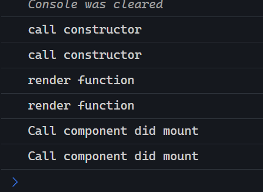
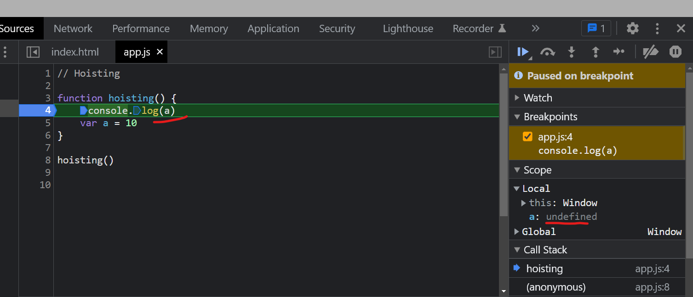
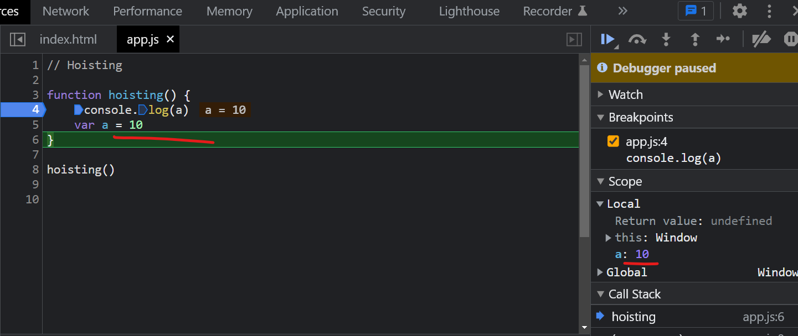
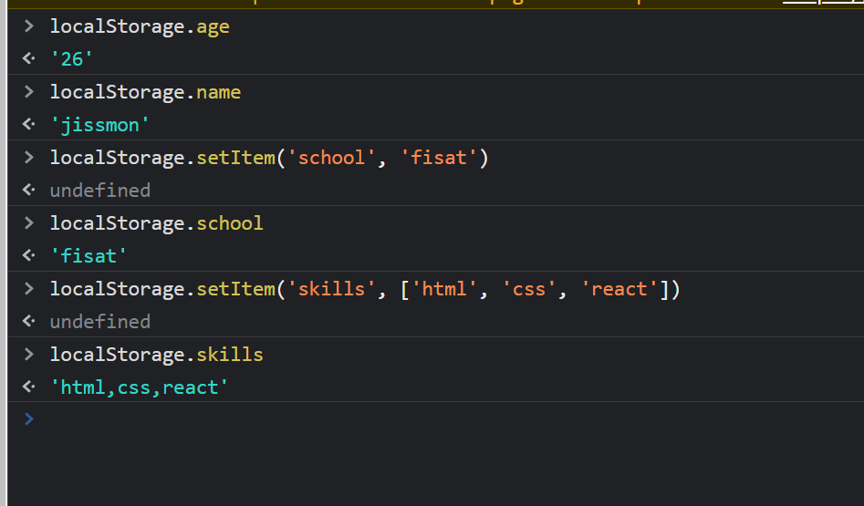

# Frontend-Developer-Technical-Interview (JavaScript & Reactjs)

[1. Map and forEach difference](#1-map-and-foreach-difference)

[2. Undefined and null difference](#2-undefined-and-null-difference)

[3. Event Delegation](#3-event-delegation)

[4. Flatten the Array](#4-flatten-the-array)

[5. var vs let vs const](#5-var-vs-let-vs-const)

[6. setTimeout function with Example](#6-setTimeout-function-with-Example)

[7. Call, Apply and Bind Methods ](#7-Call-Apply-and-Bind-Methods)

[8. Implement Promise.all() method](#8-Implement-Promise-.-all()-method)

[9. Explain lifecycle methods using class components](#9-Explain-lifecycle-methods-using-class-components)

[10. Explain lifecycle methods using functional component](#10-Explain-lifecycle-methods-using-functional-component)

[11. Ways to center a Div element](#11-Ways-to-center-a-Div-element)

[12. What is CSS Box Model](#12-what-is-css-box-model)

[13. Debounce Function in React](#13-debounce-function-in-react)

[14. Hoisting and Temporal Dead Zone](#14-hoisting-and-temporal-dead-zone)

[15. Implicit and Explicit Binding](#15-implicit-and-explicit-binding)

[16. Give Ouput based on Event Loop](#16-give-ouput-based-on-event-loop)

[17. Implement the below code](#17-implement-the-below-code)

[18. Map, Filter and Reduce Functions or Higher Order Functions](#18-map-filter-and-reduce-functions-or-higher-order-functions)

[19. Chaining Map and Filter Functions](#19-chaining-map-and-filter-functions)

[20. Polyfills of Higher Order Functions](#20-polyfills-of-higher-order-functions)

[21. React Pure Components](#21-react-pure-components)

[22. UseMemo Hook](#22-usememo-hook)

[23. Redux](#23-redux)

[24. HIGHER ORDER COMPONENTS (HOC)](#24-higher-order-components-hoc)

[25. Stateless Components](#25-stateless-components)

[26. Local Storage and Session Storage](#26-local-storage-and-session-storage)

[27. Async/Await](#27-asyncawait)

[28. useCallback hook with example](#28-usecallback-hook-with-example)

[29. Prop Drilling with Solution](#29-prop-drilling-with-solution)

[30. Why async dont works on useEffect hook but works on componentDidMount](#30-why-async-dont-works-on-useeffect-hook-but-works-on-componentdidmount)

[31. CSS Positioning](#31-css-positioning)

[32. Z Index Property](#32-z-index-property)

[33. Event Loop in JavaScript](#33-event-loop-in-javascript)

[34. Memory Hoisting](#34-memory-hoisting)

[35. What are Promises ?](#35-what-are-promises)

[36. JavaScript Closures](#36-javascript-closures)

[37. Virtual DOM](#37-virtual-dom)

[38. Functional vs Class Components](#38-functional-vs-class-components)

[39. Data Flow between Parent and Child Component](#39-data-flow-between-parent-and-child-component)

[40. Pass Data from Child to Parent](#40-pass-data-from-child-to-parent)

[41. useMemo vs React.Memo](#41-usememo-vs-reactmemo)

[42. Unmounting in Function Component](#42-unmounting-in-function-component)

[43. Controlled and Uncontrolled Components](#43-controlled-and-uncontrolled-components)

[44. PropsTypes in React](#44-propstypes-in-react)

[45. Array Slice vs Array Splice methods](#45-array-slice-vs-array-splice-methods)

[46. What are selectors in CSS ?](#46-what-are-selectors-in-css)

[47. Sass vs CSS](#47-sass-vs-css)

[48. Currying in JavaScript](#48-currying-in-javascript)


## 1. Map and forEach difference

Both are array functions to loop through the same.


```js
const array = [2,5,3,4]

// map modifies the array and store into new array.
// it wont affect the current array values. 
// map returns new array
const mappedArr = array.map((element) => element+1)
console.log(mappedArr)


// forEach will modify the current array.
// forEach wont return any array instead modifies the current array.
array.forEach((element, index) => {
    array[index]=element+4
})

console.log(array)
```

### Example 2:

```js
const nums = [1, 4, 5, 10, 14]
const newArray = []
nums.forEach(num => newArray.push(num*2))
console.log(newArray)

// here forEach updates current array values and pushes them to form new array.
// by default it wont return a new array.

```

## 2. Undefined and null difference

*undefined* means variable is declared but not initialized

```js
let a;
console.log(a)
```

*null* means a variable is initialized with a null value.

```js
const num = null
console.log(num)
```

```js
console.log(null==undefined) // true
console.log(null===undefined) // false
```

- Double equals `==` compares both the entities without matching their types. So the first case returns *true*. 

- Triple equals `===` compares both the entities with matching their types as well. So the second case returns *false*.

- null is of type object, undefined is of type undefined.

## 3. Event Delegation

If we have an ecommerce site with a bunch of products listed in it. And we want to perform an event when we click on a particular product. We dont need to add even listeners to every products or on each item of the list, because it affects our web app performance and takes lot of memory.

So what event delegation does is, we provide an event listener to the parent and access the child elements with the help of that event.


```html
<div id="products">
    <li id="shirts">shirts</li>
    <li id="shoes">shoes</li>
    <li id="bags">bags</li>
</div>
```

```js
document.querySelector('#products').addEventListener('click', (event)=>{
    window.location.href += '#'+event.target.id
})
```

So when clicking on any item our url changes.  We gave event listener only to our parent element and not to the childs. Still it worked. This is called event delegation.

## 4. Flatten the Array

```js
// Flatten the Array

let ArrayData = [
    [1,2],
    [3,4],
    [5,6,7,8,9],
    [10,11,12]
]

console.log(ArrayData.flat())
```

## 5. var vs let vs const


### Case 1 - Function and Block Scoped

*var* is function scoped. *let* and *const* keywords are block scoped. Let's explain what i meant.

```js
{
    var num = 100
}
console.log(num)
```
Above code prints `100` since scope of *var* is avaiable in and out of curly braces.


```js
{
    const num = 100
}
console.log(num)
```
Above code prints `Reference Error` since scope of *const* is only avaiable inside the curly braces or or within that block of code


```js
{
    let num = 100
}
console.log(num)
```
Above code prints `Reference Error` since scope of *let* is only avaiable inside the curly braces or within that block of code.

### Case 2: Declaration and Initialization

```js
let a = 10
let a = 20
```
- *let* cannot be redeclared. Shows Error: Identifier 'a' has already been declared

```js
let b = 50
b = 100
```
- *let* can be reinitialized with new value.

```js
var c = 100 
var c = 900
```
- *var* can be redeclared.

```js
var c = 1000
c = 500
```
- *var* can be reinitialized with new value.

```js
const v = 400
const v = 500
```
- *const* variable cannot be redeclared. Shows declaration error.

```js
const g = 1000
g = 800
```
- *const* variable cannot be reinitialized. 


Another difference is,

```js
const a;
var g;
let y;
```

Here we cannot declare a *const* without assigning a value to it. It shows `Missing initializer in const declaration`.
But we can declare *let* and *var* withour assigning a value to it. 


## 6. setTimeout function with Example

- The *setTimeout* function is a JavaScript method that allows you to execute a function after a specified amount of time.

```js
console.log("Start");
setTimeout(function () {
  console.log("Executed after 2 seconds");
}, 2000);
console.log("End");
```

- Here Start is executed first, then End is printed followed by console.log statement in *setTimeout()*.

- In this example, *setTimeout* is used to execute the anonymous function after 2 seconds (2000 milliseconds). The *console.log* statements before and after the *setTimeout* function are executed immediately.


## 7. Call, Apply and Bind Methods 

### Bind Method

- The bind method in JavaScript is used to invoke a function and set the `this` value within the function's scope.

- *Bind()* method returns a new function.

```js
const person = {
    firstName: '',
    lastName: '',
    fullName: function () {
        return this.firstName+' '+this.lastName
    }
};

const personName = person.fullName.bind({
    firstName: 'justin',
    lastName: 'varghese'
});

console.log(personName());
```

### Call Method

- The call method in JavaScript is used to invoke a function and set the `this` value within the function's scope.

- *call()* method not returns a new function, instead returns a javscript variable.

```js
const person = {
    firstName: '',
    lastName: '',
    fullName: function () {
        return this.firstName+' '+this.lastName
    }
};

const personName = person.fullName.call({
    firstName: 'justin',
    lastName: 'varghese'
});

console.log(personName);
```

### Apply Method

- The *apply* method in JavaScript is used to invoke a function and set the this value within the function's scope.

*Syntax*: 

```js
function.apply(thisArg, [arg1, arg2, ...])
```

- *thisArg* is the value of **this** inside the function.
- The second argument is an array of arguments [arg1, arg2, ...] passed to the function.


```js
const person = {
    firstName: '',
    lastName: '',
    fullName: function (greeting) {
        return greeting + ' ' + this.firstName+' '+this.lastName
    }
};

const personName = person.fullName.apply(
    {
        firstName: 'justin',
        lastName: 'varghese',
    }, 
    ['Hello']
);

console.log(personName);
```

- Here array with value `Hello` is passed as an argument to parameter `greeting`

- We cannot use arrow functions in `call()` method.


## 8. Implement Promise.all() method

https://stackblitz.com/edit/js-kmed1c?file=index.js

- The *Promise.all()* method is one of the promise concurrency methods. It can be useful for aggregating the results of multiple promises. It is typically used when there are multiple related asynchronous tasks to resolve.

- *Promise.all()* will reject immediately upon any of the input promises rejecting.'

- *Promise.all* returns an array of resolved values.

- Pass `promise` objects into `all()` method.

```js
function showText(text, time) {
    return new Promise((resolve, reject) => {
        setTimeout(() => {
            resolve(text)
        }, time);
    })
}

Promise.all([
    showText('hello javscript', 2000),
    Promise.resolve('Resolved'),
    Promise.reject('Rejected')
]).then((value)=>{
    console.log(value)
})
```

### Example - 2

```js
const promise1 = testFn1();
const promise2 = testFn2();

function testFn1() {
  return new Promise((resolve, reject) => {
    if (true) {
      resolve('Promise1 Resolved');
    }
    reject(new Error('Promise1 Rejected'));
  });
}

function testFn2() {
  return new Promise((resolve, reject) => {
    if (true) {
      resolve('Promise2 resloved');
    }
    reject(new Error('Promise2 Rejected'));
  });
}

Promise.all([promise1, promise2])
  .then((value) => {
    console.log(value);
  })
  .catch((error) => {
    console.log(error.message);
  });
```

Ouput:

```bash
["Promise1 Resolved", "Promise2 resloved"]
```

## 9. Explain lifecycle methods using class components

### 1. componentDidMount method

https://github.com/jisshub/Namaste-React-Course#1-componentdidmount


- **componentDidMount** runs when our component is rendered for the first time.

- Use cases are when we want to fetch from our API's, or provide some initial values to our state variable on first component render.

```jsx
import React from 'react';

class Parent extends React.Component {
  constructor(props) {
    super(props);
    console.log('call constructor');
  }
  componentDidMount() {
    console.log('Call component did mount');
  }
  render() {
    console.log('render function');
    return (
      <div>
        <h1>Test</h1>
      </div>
    );
  }
}

export default Parent;
```



- We can observe that `componentDidMount` is called after `construtor` and `render` method is called.


### 2. componentDidUpdate method

- **componentDidUpdate** runs everytime when our component states or props are updated.

- In below program, whenever button is clicked **componentDidUpdate** runs because our state gets updated.

**App.js**

```jsx
import Counter from "./components/Counter";

class App extends React.Component {
  state = {
    number: 10
  };
  componentDidMount() {
    console.log("componentDidMount runs");
  }
  componentDidUpdate() {
    console.log("component did update runs");
  }
  handleClick() {
    this.setState({ number: this.state.number + 1 });
  }
  render() {
    return (
      <>
        <button onClick={this.handleClick.bind(this)}>Hello</button>

        {/* pass prop number to Counter component  */}
        <Counter number={this.state.number} />
      </>
    );
  }
}

export default App;
```

**Counter.jsx**

```jsx
class Counter extends React.Component {
  render() {
    // get the prop passed using this.props
    return <h2>{this.props.number} times</h2>;
  }
}

export default Counter;
```

### 2. componentWillUnmount method

- This method runs when our component is removed from our app or when it is unmounted.

**Counter.js**

```js
componentWillUnmount() {
    console.log("componentwillunmount runs");
}
```

**App.js**

```js
 return (
    <div className="App">
      {/* <Counter count={count} /> */}
      <button onClick={handleClick}>Increment</button>
    </div>
  );
```


These 3 are the life cycle methods of React.


## 10. Explain lifecycle methods using functional component

- To use life cycle method in react functional component, we use a hook called **useEffect**.

- *useEffect* takes a callback function and a dependancy array.

https://github.com/jisshub/Namaste-React-Course#useeffect-hook


### Case 1: Empty Dependancy Array / componentDidMount

```js
function Counter({ count }) {
  useEffect(() => {
    console.log("Component is mounted");
  }, []);
  return (
    <>
      <h1>{count} times</h1>
    </>
  );
}

export default Counter;
```

- It runs only once when our component is mounted initially because the array of dependency is empty.


### Case 2: Passing a Dependancy Array / componentDidUpdate

- Here *useEffect* runs everytime when *count* prop is updated or the state passed in to dependancy array changes.

```jsx
function Counter({ count }) {
  useEffect(() => {
    console.log("Component is updated");
  }, [count]);
  return (
    <>
      <h1>{count} times</h1>
    </>
  );
}

export default Counter;
```

### Case 3: Component is Unmounted

- It runs when our component is removed from app or unmounted.

**Counter.js**

```js
function Counter({ count }) {
  useEffect(() => {
    console.log("component is updated");
    return () => {
      console.log("component is unmounted");
    };
  }, [count]);
  return (
    <>
      <h1>{count} times</h1>
    </>
  );
}
```

**App.js**

```js
 return (
    <div className="App">
      {/* <Counter count={count} /> */}
      <button onClick={handleClick}>Increment</button>
    </div>
  );
```

- Here, component *Counter* is unmounted from our App. Then *useEffect* runs.


#### Case 4: No dependancy array for useEffect hook

```js
useEffect(() => {
    console.log('call useeffect hook!')
})
```

Here, useEffect hook is called only after each & every render.


## 11. Ways to center a Div element


```html
<div class="parent">
    <h2 class="child">
        Center this
    </h2>
</div>
```

### Case 1: Using flexbox

```css
.parent {
  display: flex;
  justify-content: center
}
```

### Case 2: Set Width to 50% and Margin Property to auto.

```css
.parent { 
    width: 50%;
    margin: auto;
}
.child {
    border: 2px solid green;
    padding: 20px;
    text-align: center;
}
```


### Case 3: Center a div both horizaontaly and vertically.

```css
.parent { 
    text-align: center;
    width: 100%;
    height: 100%;
}
.child {
    position: absolute;
    top: 50%;
    left: 50%;
    transform: translate(-50%, -50%);
}
```

## 12. What is CSS Box Model

```html
<h3 class="child-box">
    Header 3
</h3>
```

```css
.child-box {
    border: 5px solid slateblue;
    padding: 20px;
    margin: 10px;
    width: 100px;
}
```

- These 4 properties(border, padding, margin and width) on HTML element are combined to form a css box model. Every single HTML element has these 4 properties.

- We can view the same in below picture. For that `h3` element there exist 4 properties such as *padding, border, width and margin*. So these 4 are combined to form a *css box model*.


## 13. Debounce Function in React

Go to flipkart, search for a product, when we stop writing for a product, after a few milliseconds, the results are fetched. This is called *debouncing*.

https://codesandbox.io/s/debounce-functionality-in-react-hgdbve

```jsx
import "./styles.css";

export default function App() {
  const myDebounce = (cb, d) => {
    let timer;
    return function (...args) {
      if (timer) clearTimeout(timer);
      timer = setTimeout(() => {
        cb(...args);
      }, d);
    };
  };

  const handleChange = myDebounce((e) => {
    console.log(e.target.value);
  }, 1000);

  return (
    <div className="App">
      <input onChange={handleChange} />
    </div>
  );
}
```

In above program, when user stops writing the input in the field, after 1 second, content that is typed is printed on conole.


## 14. Hoisting and Temporal Dead Zone

- We hoist a variable even before it is initialized.

```js
function hoisting() {
    console.log(a)
    var a = 10
}

hoisting()
```

-  Here, *console.log(a)* returns undefined since a is not defined before the *console.log* statement. 


Check below two images for more:

- In first case, a is undefined. 
- In second case, a is defined with 10.






### Example 2:

```js
function hoisting() {
    console.log(a, b, c)
    var a = 10
    const b = 20
    let c = 30
}

hoisting()
```

- Here we add const and let keyword. It throws `reference error`. 

- But the *const* and *let* variables are hoisted in a **temporal dead zone**.

- *Temporal dead zone* is the time between the declaration and initialization of the *let* and *const* variables.


## 15. Implicit and Explicit Binding

### Case 1: Using anonymous function

```js
const fun = {
    name: 'vijay',
    display: function () {
        console.log(this.name)
    }
}

const data = {
    name: 'ajith'
}

fun.display.call(data)
```

- Bind new object into display function. we replace current object in display function with data object. So the name is updated.

### Case 1: Using Arrow Functions

```js
const fun = {
    name: 'vijay',
    display: ()=> {
        console.log(this.name)
    }
}

const data = {
    name: 'ajith'
}

fun.display.call(data)
```

- console is empty in case of arrow functions.


## 16. Give Ouput based on Event Loop 

```js
console.log('a')
setTimeout(() => {
   console.log('set') 
}, 0);
Promise.resolve(() => console.log("pro")).then(res => res());
console.log('b')
```

**Output:**

```console
a
b
pro
set
```

To understand how this works, Go to below url
https://www.jsv9000.app/


## 17. Implement the below code

**Question:**

```js
const result = calc.add(10).multiply(50).subtract(30).add(10)
console.log(result.total)
```


```js
const calc = {
    total: 0,
    add(a) {
        this.total += a
        return this
    },
    multiply(a) {
        this.total *= a
        return this
    },
    subtract(a) {
        this.total -= a
        return this
    }
}

const result = calc.add(10).multiply(5).subtract(30).add(10)
console.log(result.total)
```
- We create an object `calc` with functions `add, subtract` and `mulitply`.
- We initialize a `total` variable with 0.
- We update `total` variable w.r.t each functions.
- We return the `this` object after every function to access the following functions.


## 18. Map, Filter and Reduce Functions or Higher Order Functions

- map, filter and reduce are higher order functions in javscript.

## Map Function

- To transform an array and return a new array.

- Map each values in the array and return the result in new array.

```js
const array1 = [5, 1, 3, 2, 6]
const mappedArray = array1.map((value) => value * 3)
console.log(mappedArray)
```

### Get Full Names from Array Using Map

```js
const users = [
    {firstName: 'akshay', lastName: 'saini', age: 24},
    {firstName: 'jissmon', lastName: 'jose', age: 26},
    {firstName: 'ajith', lastName: 'kumar', age: 28}
]

const fullNamesArray = users.map((user) => {
    return `${user.firstName} ${user.lastName}` 
});
console.log(fullNamesArray)
```

## Filter Function

- filter out values from an array that matches a condition and form a new array with returned values.

```js
const array1 = [5, 1, 3, 2, 6]
const filteredArr = array1.filter((value) => value > 4)
console.log(filteredArr)
```

- Here all the values > 4 is filtered out into new array.


## Reduce Function

- Take all values in an array and come up with a single value from them.

- For example, if we have array of values and we want to find sum of all the values.

### Find sum of an array using reduce method.

```js
function findSum(array1) {
    let sum=0; 
    for (let i = 0; i < array1.length; i++) {
        sum+=array1[i]
    }
    return sum;
}
console.log(findSum(array1))
```

- We can perform the same using `reduce` by iterating over each values and find the total. 

- `reduce` takes 2 arguments.
  1. A Function
  2. Initial Value which is used to pass to accumulator variable. It is set to 0.

- Function has 2 parameters.
  1. Accumulator
  2. Current Value.

- `Current value` parameter represents each and every values in the array when reduce function iterates over it.

- `Accumulator` parameter accumulates each values in the array and returns the final result after the iteration of array.

- Find sum of an array using normal method.

```js
const sumArray = array1.reduce((acc, currentValue) => {
    acc += currentValue
    return acc
}, 0)
console.log(sumArray)
```

### Find Maximum value in an array using normal method.

```js
function largestValue(array1) {
    let maxValue = 0
    for (let index = 0; index < array1.length; index++) {
        if (array1[index] > maxValue) {
            maxValue=array1[index]
        } 
    }
    return maxValue;
}
```

### Find Maximum value in an array using reduce function.

```js
const maxArray = array1.reduce((acc, curr)=>{
    if (curr > acc) {
        acc = curr
    }
    return acc
}, 0)
console.log(maxArray)
```

## 19. Chaining Map and Filter Functions

### First names of all people whose age < 30

- We can chain higher order functions together.

```js
const usersArr = [
    {firstName: 'akshay', lastName: 'saini', age: 24},
    {firstName: 'jissmon', lastName: 'jose', age: 36},
    {firstName: 'ajith', lastName: 'kumar', age: 46},
    {firstName: 'prithvi', lastName: 'kumar', age: 28},
    {firstName: 'bhushan', lastName: 'kumar', age: 24}
]

const output = usersArr.filter(user => user.age < 30).map((user) => {
    return user.firstName
})
console.log(output)
```

## 20. Polyfills of Higher Order Functions

https://www.youtube.com/watch?v=zdp0zrpKzIE

<!-- time: 18:50 -->


## 21. React Pure Components

- A pure component in React is a type of component that implements a shouldComponentUpdate lifecycle method. The method is used to determine if the component should re-render based on the changes in its props. If there are no changes, the component will not re-render, making it faster and more efficient.

Here's an example of a PureComponent in React:

**MyPureCOmponnet.js**
```jsx
import React, { PureComponent } from 'react';

class MyPureComponent extends PureComponent {
  render() {
    return (
      <div>
        <h1>{this.props.title}</h1>
        <p>{this.props.description}</p>
      </div>
    );
  }
}

export default MyPureComponent;
```

- And here's an example of how you might use the above PureComponent in another component:

**App.js**

```jsx
import React from 'react';
import MyPureComponent from './MyPureComponent';

export default function App() {
  const [title, setTitle] = useState("My New Title");
  const [description, setDescription] = useState("My New Description");

  return (
    <div className="App">
      <MyPureComponent title={title} description={description} />
    </div>
  );
}
```


## 22. UseMemo hook

- React's useMemo hook is used to optimize the performance of your components by memorizing the values of expensive calculations. It takes two arguments: a function that returns the value to be memorized and a list of dependencies. The hook will only re-compute the value if one of the dependencies has changed.


**Calculation.js**

```js
import { useMemo } from "react";

function Calculation({ data }) {
  const memoizedValue = useMemo(() => {
    data.reduce((acc, curr) => {
      acc += curr;
      return acc;
    }, 0);
  }, [data]);
  return <div>{memoizedValue}</div>;
}

export default Calculation;
```

**App.js**

```js
export default function App() {
  const data = [10, 28, 30, 40, 50, 60];
  return <Calculation data={data} />;
}
```

- Here `useMemo` hooks runs when `data` prop changes.


## 23. Redux

Redux is a popular state management library for JavaScript applications, often used with React. It provides a centralized store for all the data needed by your application and a way to manage the changes to that data.

In a **React + Redux** setup, all your application's state is stored in a single, global `store` object managed by Redux. React components subscribe to the `store` to receive updates when the state changes. When a user interacts with your app, `actions` are dispatched which describe the changes to the `state`. Redux then updates the state in the store, and React re-renders the components that depend on the state.

This architecture makes it easy to write and maintain complex, data-driven applications because all the state is managed in a single place.

Here's a high-level overview of the **steps involved in a typical Redux flow in a React app**:

**Dispatch an action**: A user interacts with the application and an action is dispatched with the updated data.

**Update the store**: The action is received by the Redux store, which updates its state based on the action type and payload.

**React components re-render**: The React components that are connected to the Redux store receive the updated state and re-render themselves with the new data.

In summary, Redux provides a centralized store for state management and a way to manage the changes to that state using actions and reducers, making it easier to build complex, data-driven applications in React.

### A simple example to demonstrate how Redux can be used in a React application

Here's a simple example to demonstrate how Redux can be used in a React application:

Let's say you have a React component that displays a counter, and you want to manage the state of the counter using Redux.


### Redux + React folder structure


```java
my-app/
├── node_modules/
├── public/
│   └── index.html
├── src/
│   ├── actions/
│   │   └── index.js
│   ├── components/
│   │   └── Counter.js
│   ├── containers/
│   │   └── CounterContainer.js
│   ├── reducers/
│   │   └── index.js
│   ├── store/
│   │   └── index.js
│   └── index.js
├── package.json
└── package-lock.json
```

Here's what each folder contains:

**node_modules/:** This folder contains all the libraries and dependencies required for the project.

**public/:** This folder contains any static assets or files that don't change, such as the index.html file.

**src/:** This folder contains all the source code for the application.

**src/actions/:** This folder contains all the action creators, which are functions that return action objects.

**src/components/:** This folder contains the React components that make up the UI of the application.

**src/containers/:** This folder contains the containers, which are components that are connected to the Redux store.

**src/reducers/:** This folder contains the reducers, which are functions that update the state in the Redux store based on the actions that are dispatched.

**src/store/:** This folder contains the configuration for the Redux store, such as the reducer and any middleware you want to use.

**src/index.js:** This file is the entry point for the application and sets up the store, the React components, and the routing (if applicable).

https://chat.openai.com/chat/48f5dd47-d81b-40a3-8023-f65de5482bf1


## 24. HIGHER ORDER COMPONENTS (HOC) 

- Higher Order Components (HOCs) in React are advanced techniques in React for reusing component logic. 
- HOCs are JavaScript functions that take a component and return a new component with additional props. 
- HOCs do not modify or mutate the original component, they wrap it and provide additional functionality. 

Example usage of HOC:

```js
const withLoading = (Component) => {
  return function WithLoading(props) {
    return props.isLoading ? <Loading /> : <Component {...props} />;
  }
}

const UserListWithLoading = withLoading(UserList);
```

- Here, withLoading is an HOC that takes a component Component and returns a new component that adds a loading indicator when the isLoading prop is true.


## 25. Stateless Components

- Stateless components, also known as functional components, in React are components that do not have an internal state or lifecycle methods. They receive props as input and render the UI based on those props.

- Here is an example of a stateless component in React:

```js
import React from 'react';

const Greeting = (props) => {
  return (
    <div>
      Hello, {props.name}!
    </div>
  );
}

export default Greeting;
```

- In this example, Greeting is a stateless component that takes a name prop and renders a greeting. The component can be used in another component like this:

```js
import React from 'react';
import Greeting from './Greeting';

const App = () => {
  return (
    <div>
      <Greeting name="John" />
    </div>
  );
}

export default App;
```


## 26. Local Storage and Session Storage

`Local Storage` and `Session Storage` are two web storage options for storing data on the client-side (in the browser) for web applications.

**Local Storage:** It is a type of web storage that allows you to store data on the client-side and persist it even after the browser is closed. The data stored in local storage has no expiration date and remains until it's deleted by the application or the user.

**Session Storage:** It is similar to local storage but the data stored in session storage is deleted as soon as the user closes the browser or when the session ends.

Both options provide a simple key-value store, with a maximum size limit of 5MB, and can be used to store strings, arrays, and objects.

### Syntax For Local Storage:

```console
localStorage.setItem('key', 'values')
localStorage.getItem('key')
```



### Syntax For Session Storage:

```console
localStorage.setItem('key', 'values')
localStorage.getItem('key')
```

## 27. Async/Await

**async/await** is a modern way to handle asynchronous code in JavaScript, using Promises.

Here's an example to understand how it works:

```js
async function fetchData() {
  // fetch returns a Promise, we wait to resolve promise by using 
  // await keyword before fetch. then we get response object
  const response = await fetch('https://api.example.com/data');
  // We get a promise when we call json() on response object, 
  // we wait to resolve it by again using await keyword before response.json(), now we get json data.
  const data = await response.json();
  return data;
}

// fetchData returns a promise, to resolve it we directly use then to get data. 
// if error exist catch is called.
fetchData()
  .then(data => console.log(data))
  .catch(error => console.error(error));
```

Explanation:

1. fetch returns a Promise, we wait to resolve promise by using await keyword before fetch. then we get response object.

2.  We get a promise when we call json() on response object, we wait to by again using await keyword before response.json(), now we get json data.

3. fetchData returns a promise, to resolve it we directly use then to get data. if error exist catch is called.


## 28. useCallback hook with example

The useCallback hook is a React hook that helps you optimize the performance of your components by allowing you to pass a function as a prop to a child component without re-creating the function on every render.


Here's a simple example:

```js
import React, { useState, useCallback } from 'react';

function Counter() {
  const [count, setCount] = useState(0);

  const increment = useCallback(() => {
    setCount(c => c + 1);
  }, [setCount]);

  return (
    <div>
      <Display count={count} />
      <Button increment={increment} />
    </div>
  );
}

function Display({ count }) {
  return <div>{count}</div>;
}

function Button({ increment }) {
  return <button onClick={increment}>Increment</button>;
}
```

In this example, we have a Counter component that manages the count state and a increment function that increments the count. The increment function is passed as a prop to the Button component.

Without useCallback, the increment function would be re-created on every render, causing the Button component to re-render even if its props haven't changed. This can lead to unnecessary render cycles and decreased performance.

With useCallback, the increment function is only re-created if its dependencies (in this case, setCount) change. This helps optimize the performance of your components by ensuring that child components only re-render when they need to.

## 29. Prop Drilling with Solution

https://github.com/jisshub/React-Prop-Drilling-Solution/tree/main/demo-app


"Props drilling" is a term used in React to describe the process of passing data from a parent component down to a child component through a series of intermediate components. This can be cumbersome and lead to tightly coupled components if not done carefully. Here are a few solutions to avoid excessive props drilling:

**Use Context**: Context provides a way to pass data through the component tree without having to pass props down manually at every level. You can create a context object and use the Provider component to wrap the top-level component that needs access to the data, and then use the Consumer component to access the data from any child component that needs it.

**Use a state management library**: State management libraries like Redux or MobX can help you manage global state in your application. By storing data in a centralized location, you can avoid passing it down through multiple levels of components.

**Use higher-order components:** Higher-order components (HOCs) allow you to wrap a component with additional functionality. You can create an HOC that provides the necessary data to the wrapped component, without having to pass it down through every level of the component tree.


### Prop Drilling Example 

Below example causes prop drilling. Here we pass prop from `Parent` Component to `ChildC` Component through components `ChildA` and `ChildB`. Since `ChildA` and `ChildB` dont actually need the props, it causes prop drilling. `ChildC` only needs the props, So it is not required to pass the prop to other component.

```js
import { useState } from "react"

const Parent = () =>{ 
    const [fName, setfName] = useState('jissmon')
    const [lName, setlName] = useState('jose')

    return (
        <>
            <h1>This is a parent component</h1>
            <ChildA fName={fName} lName={lName} />
        </>
    )
}

const ChildA = ({fName, lName}) => {
    return (
        <>
            <h2>This is a Child component A</h2>
            <ChildB fName={fName} lName={lName} />
        </>
    )
}

const ChildB = ({fName, lName}) => {
    return (
        <>
            <h3>This is Child component B</h3>
            <ChildC fName={fName} lName={lName} />
        </>
    )
}

const ChildC = ({fName, lName}) => {
    return (
        <>
            <h4>Data from parent component is below shown</h4>
            <div>
                <h5>Full Name: {fName} {lName}</h5>
            </div>
        </>
    )
}

export default Parent
```

### Prevent prop drilling by using Context

Using context, we prevent the props to be passed through intermediary components to finaly reach the Component `ChildC`. We access the props in `ChildC` component directly using context. Thus not causing prop drilling.

```js
import React, { useState, useContext } from "react"

let context = React.createContext(null)
const ParentContext = () => {
    
    const [fName, setfName] = useState('jissmon')
    const [lName, setlName] = useState('jose')

    return (
        <context.Provider value={{fName, lName}}>
            <>
                <h1>This is a parent component</h1>
            </>
            <ChildA />
        </context.Provider>
    )
}

const ChildA = () =>{
    return (    
        <>
            <h1>This is a ChildA component</h1>
            <ChildB />
        </>
    )
}

const ChildB = () =>{
    return (    
        <>
            <h1>This is a ChildB component</h1>
            <ChildC />
        </>
    )
}

const ChildC = () =>{
    // destructure the props from context object
    const {fName, lName} = useContext(context)
    return (    
        <>
            <h1>This is a ChildC component</h1>
            <h2>
                Data from parent component is below
            </h2>
            <h3>FullName: {fName} {lName}</h3>
        </>
    )
}

export default ParentContext;
```

## 30. Why async dont works on useEffect hook but works on componentDidMount

- In React, useEffect is a Hook that allows you to perform side effects in function components. It's designed to work with synchronous functions, and it doesn't support an async function as its callback.

- The reason for this is that useEffect relies on the return value of the function you pass to it in order to perform cleanup actions. If you use an async function, it returns a Promise object, which is not what useEffect is expecting. This can lead to unexpected behavior and bugs.

- On the other hand, componentDidMount() is a lifecycle method in class components that's called once when the component is mounted to the DOM. This method is synchronous, and you can use an async function inside it because it doesn't rely on a return value for cleanup.

- If you want to perform asynchronous actions inside a useEffect hook, you can use a regular function and wrap your async calls in it. For example:

```js
useEffect(() => {
  const fetchData = async () => {
    const response = await fetch('https://example.com/data');
    const data = await response.json();
    // do something with the data
  };

  fetchData();
}, []);
```

- In this example, we define a regular function fetchData that wraps the async call to fetch data. We then call fetchData inside the useEffect hook. This allows us to use async calls inside fetchData without causing issues with the useEffect hook.

## 31. CSS Positioning

Both `position: absolute` and `position: relative` are CSS positioning properties used to place elements on a web page.

### 1. position: absolute

- `position: absolute` is used to position an element relative to its closest positioned ancestor

### 2. position: relative

- `position: relative`is used to position an element relative to its normal position in the document flow.


In summary, `position: absolute` is used to take an element out of the normal document flow and position it precisely, while `position: relative` is used to adjust the position of an element relative to its normal position in the document flow.


## 32. Z Index Property 


## 33. Event Loop in JavaScript

https://github.com/jisshub/Namaste-Javascript#event-loop-in-javascript

## 34. Memory Hoisting

https://www.programiz.com/javascript/hoisting

https://stackblitz.com/edit/js-2ramnx?file=index.js%3AL5

Hoisting in JavaScript is a behavior in which a function or a variable can be used before declaration. For example,

```js
// using test before declaring
console.log(test);   // undefined
var test;
```

### Variable Hoisting
In terms of variables and constants, keyword var is hoisted and let and const does not allow hoisting.

```js
a = 5;
console.log(a);
var a;
```

If a variable is used with the let keyword, that variable is not hoisted. For example,

```js
a = 5;
console.log(a);
let a; // error
```

While using let, the variable must be declared first.


### Function Hoisting

A function can be called before declaring it. For example,

```js
greet();

function greet() {
    console.log('Hi, there.');
}
```

However, when a function is used as an expression, an error occurs because only declarations are hoisted. For example;

```js
greet();

let greet = function() {
    console.log('Hi, there.');
}
```

## 35. What are Promises ?


## 36. JavaScript Closures

- Javascript closure gives you access to an outer function's scope from an inner function. 
- In JavaScript, closures are created every time a function is created.

```js
function outer(){
  const name = 'jissmon'
  function inner(){
    console.log(name)
  }
  innner()
}
outer()
```

## 37. Virtual DOM


## 38. Functional vs Class Components


## 39. Data Flow between Parent and Child Component


## 40. Pass Data from Child to Parent


## 41. useMemo vs React.Memo


## 42. Unmounting in Function Component


## 43. Controlled and Uncontrolled Components


## 44. PropsTypes in React

- **PropTypes** is a feature in React that allows you to check the types of props passed to a component. It's a way of validating that the data passed into a component is the correct data type.

- **PropTypes** is a built-in feature in React that allows you to define the expected type of each prop that a component accepts. This can help you catch bugs early and make it easier to maintain your code as your application grows.

- To use **PropTypes** in your React components, you need to import it from the `prop-types` package and define the expected types of your props in the component's propTypes object. For example, if you have a component that expects a string prop called `name`, you would define the propTypes like this:

  ```js
  import PropTypes from 'prop-types';

  function MyComponent(props) {
    return <div>{props.name}</div>;
  }

  MyComponent.propTypes = {
    name: PropTypes.string
  };
  ```

- In this example, we're using PropTypes.string to indicate that the "name" prop should be a string. If the "name" prop is passed in as anything other than a string, React will log a warning in the console.


## 45. Array Slice vs Array Splice methods

https://stackblitz.com/edit/js-x3ptv3?file=index.js

- `Array.slice()` returns a shallow copy of a portion of an array into a new array, without modifying the original array. 
- It takes two optional parameters: `start` and `end`. 
- The `start` parameter is the index at which to begin the slice (inclusive), and the `end` parameter is the index at which to end the slice (exclusive). 
- If end is not provided, the slice will continue to the end of the array. The original array remains unchanged.

```js
const fruits = ['apple', 'banana', 'orange', 'grapefruit', 'lime', 'lemon'];
const citrus = fruits.slice(2, 5);
console.log(citrus); // ['orange', 'grapefruit', 'lime']
console.log(fruits); // ['apple', 'banana', 'orange', 'grapefruit', 'lime', 'lemon']
```

- `Array.splice()` changes the contents of an array by removing or replacing existing elements and/or adding new elements. 
- It takes three or more parameters: `start`, `deleteCount`, and any additional `elements` to add to the array. 
- The `start` parameter is the index at which to start changing the array. 
- The `deleteCount` parameter specifies how many elements to remove starting at the start index.

```js
const fruits = ['apple', 'banana', 'orange', 'grapefruit', 'lime', 'lemon'];
fruits.splice(2, 2, 'kiwi');
console.log(fruits); // ['apple', 'banana', 'kiwi', 'lime', 'lemon']
```
- In summary, `Array.slice()` returns a copy of a portion of an array, while `Array.splice()` changes the contents of an array by adding, removing, and/or replacing elements.


## 46. What are selectors in CSS ?

**Element selectors**: They target elements based on their tag names. For example, the selector `p` will target all `p` tags on a web page

**Class selectors:** They target elements that have a specific class attribute value. For example, the selector `.my-class` will target all elements that have `class="my-class"`.

**ID selectors:** They target elements that have a specific `id` attribute value. For example, the selector `#my-id` will target the element that has `id="my-id"`.

**Pseudo-class selectors:** They target elements based on a specific state or behavior. For example, the selector `a:hover` will target all the `a` tags when they are being hovered over by the user.

**Combinators:** They combine selectors to target specific elements. For example, the selector `p + p` will target all `p` tags that come immediately after another `p` tag.


## 47. Sass vs CSS

`Sass` and `CSS` are both styling languages used to style web pages. However, `Sass` is a preprocessor that extends the functionality of `CSS` and makes it more efficient and easier to use. Here are some of the differences between Sass and CSS:

1. **Syntax:** Sass has its own syntax, which is a superset of CSS. This means that all valid CSS is also valid Sass, but Sass has additional features and syntax that are not available in CSS.

2. **Variables:** Sass allows you to define variables, which can be used to store and reuse values throughout your code.

3. **Nesting:** Sass allows you to nest selectors inside one another, making it easier to write and read complex CSS rules.

4. **Mixins:** Sass allows you to define mixins, which are reusable pieces of code that can be included in multiple selectors.

5. **Functions:** Sass allows you to define functions, which can be used to perform calculations or manipulate values. 

## 48. Currying in JavaScript

- In other words, `currying` is the process of breaking down a function that takes multiple arguments into a series of functions that each take one argument.

- The curried function returns a new function that expects the next argument until all the arguments are collected and the final result is returned.

```js
function add(a) {
  return function(b) {
    return a + b;
  }
}

const addFive = add(5);
console.log(addFive(3)); // Output: 8
```

- In this example, `add` is a curried function that takes a single argument `a` and returns a new function that takes another argument `b`. The returned function adds a and b together and returns the result.

- When we call `add(5)`, it returns a new function that adds 5 to any argument passed to it. We assign this new function to `addFive` and call it with 3. The result is 8.

