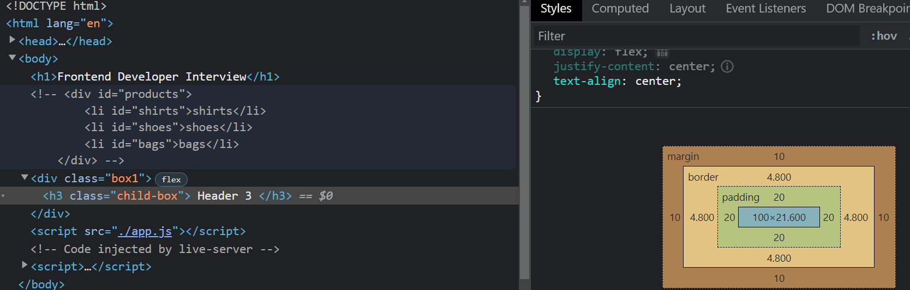

# Frontend-Developer-Technical-Interview (Reactjs)

[1. Map and forEach difference](#1-map-and-foreach-difference)

[2. Undefined and null difference](#2-undefined-and-null-difference)

[3. Event Delegation](#3-event-delegation)

[4. Flatten the Array](#4-flatten-the-array)

[5. var vs let vs const](#5-var-vs-let-vs-const)

[6. setTimeout function with Example](#6-setTimeout-function-with-Example)

[7. Call, Apply and Bind Methods ](#7-Call-Apply-and-Bind-Methods)

[8. Implement Promise.all() method](#8-Implement-Promise-.-all()-method)

[9. Explain lifecycle methods using class components](#9-Explain-lifecycle-methods-using-class-components)

[10. Explain lifecycle methods using functional component](#10-Explain-lifecycle-methods-using-functional-component)

[11. Ways to center a Div element](#11-Ways-to-center-a-Div-element)


[12. What is CSS Box Model](#12-what-is-css-box-model)

[13. Debounce Function in React](#13-debounce-function-in-react)


## 1. Map and forEach difference

Both are array functions to loop through the same.


```js
const array = [2,5,3,4]

// map modifies the array and store into new array.
// it wont affect the current array values. 
// map returns new array
const mappedArr = array.map((element) => element+1)
console.log(mappedArr)


// forEach will modify the current array.
// forEach wont return any array instead modifies the current array.
array.forEach((element, index) => {
    array[index]=element+4
})

console.log(array)
```

### Example 2:

```js
const nums = [1, 4, 5, 10, 14]
const newArray = []
nums.forEach(num => newArray.push(num*2))
console.log(newArray)

// here forEach updates current array values and pushes them to form new array.
// by default it wont return a new array.

```

## 2. Undefined and null difference

*undefined* means variable is declared but not initialized

```js
let a;
console.log(a)
```

*null* means a variable is initialized with a null value.

```js
const num = null
console.log(num)
```

```js
console.log(null==undefined) // true
console.log(null===undefined) // false
```

- Double equals `==` compares both the entities without matching their types. So the first case returns *true*. 

- Triple equals `===` compares both the entities with matching their types as well. So the second case returns *false*.

- null is of type object, undefined is of type undefined.

## 3. Event Delegation

If we have an ecommerce site with a bunch of products listed in it. And we want to perform an event when we click on a particular product. We dont need to add even listeners to every products or on each item of the list, because it affects our web app performance and takes lot of memory.

So what event delegation does is, we provide an event listener to the parent and access the child elements with the help of that event.


```html
<div id="products">
    <li id="shirts">shirts</li>
    <li id="shoes">shoes</li>
    <li id="bags">bags</li>
</div>
```

```js
document.querySelector('#products').addEventListener('click', (event)=>{
    window.location.href += '#'+event.target.id
})
```

So when clicking on any item our url changes.  We gave event listener only to our parent element and not to the childs. Still it worked. This is called event delegation.

## 4. Flatten the Array

```js
// Flatten the Array

let ArrayData = [
    [1,2],
    [3,4],
    [5,6,7,8,9],
    [10,11,12]
]

console.log(ArrayData.flat())
```

## 5. var vs let vs const


### Case 1 - Function and Block Scoped

*var* is function scoped. *let* and *const* keywords are block scoped. Let's explain what i meant.

```js
{
    var num = 100
}
console.log(num)
```
Above code prints `100` since scope of *var* is avaiable in and out of curly braces.


```js
{
    const num = 100
}
console.log(num)
```
Above code prints `Reference Error` since scope of *const* is only avaiable inside the curly braces or or within that block of code


```js
{
    let num = 100
}
console.log(num)
```
Above code prints `Reference Error` since scope of *let* is only avaiable inside the curly braces or within that block of code.

### Case 2: Declaration and Initialization

```js
let a = 10
let a = 20
```
- *let* cannot be redeclared. Shows Error: Identifier 'a' has already been declared

```js
let b = 50
b = 100
```
- *let* can be reinitialized with new value.

```js
var c = 100 
var c = 900
```
- *var* can be redeclared.

```js
var c = 1000
c = 500
```
- *var* can be reinitialized with new value.

```js
const v = 400
const v = 500
```
- *const* variable cannot be redeclared. Shows declaration error.

```js
const g = 1000
g = 800
```
- *const* variable cannot be reinitialized. 


Another difference is,

```js
const a;
var g;
let y;
```

Here we cannot declare a *const* without assigning a value to it. It shows `Missing initializer in const declaration`.
But we can declare *let* and *var* withour assigning a value to it. 


## 6. setTimeout function with Example

- The *setTimeout* function is a JavaScript method that allows you to execute a function after a specified amount of time.

```js
console.log("Start");
setTimeout(function () {
  console.log("Executed after 2 seconds");
}, 2000);
console.log("End");
```

- Here Start is executed first, then End is printed followed by console.log statement in *setTimeout()*.

- In this example, *setTimeout* is used to execute the anonymous function after 2 seconds (2000 milliseconds). The *console.log* statements before and after the *setTimeout* function are executed immediately.


## 7. Call, Apply and Bind Methods 

### Bind Method

- The bind method in JavaScript is used to invoke a function and set the `this` value within the function's scope.

- *Bind()* method returns a new function.

```js
const person = {
    firstName: '',
    lastName: '',
    fullName: function () {
        return this.firstName+' '+this.lastName
    }
};

const personName = person.fullName.bind({
    firstName: 'justin',
    lastName: 'varghese'
});

console.log(personName());
```

### Call Method

- The call method in JavaScript is used to invoke a function and set the `this` value within the function's scope.

- *call()* method not returns a new function, instead returns a javscript variable.

```js
const person = {
    firstName: '',
    lastName: '',
    fullName: function () {
        return this.firstName+' '+this.lastName
    }
};

const personName = person.fullName.call({
    firstName: 'justin',
    lastName: 'varghese'
});

console.log(personName);
```

### Apply Method

- The *apply* method in JavaScript is used to invoke a function and set the this value within the function's scope.

*Syntax*: 

```js
function.apply(thisArg, [arg1, arg2, ...])
```

- *thisArg* is the value of **this** inside the function.
- The second argument is an array of arguments [arg1, arg2, ...] passed to the function.


```js
const person = {
    firstName: '',
    lastName: '',
    fullName: function (greeting) {
        return greeting + ' ' + this.firstName+' '+this.lastName
    }
};

const personName = person.fullName.apply(
    {
        firstName: 'justin',
        lastName: 'varghese',
    }, 
    ['Hello']
);

console.log(personName);
```

- Here array with value `Hello` is passed as an argument to parameter `greeting`


## 8. Implement Promise.all() method

- The *Promise.all()* method is one of the promise concurrency methods. It can be useful for aggregating the results of multiple promises. It is typically used when there are multiple related asynchronous tasks to resolve.

- *Promise.all()* will reject immediately upon any of the input promises rejecting.

```js
function showText(text, time) {
    return new Promise((resolve, reject) => {
        setTimeout(() => {
            resolve(text)
        }, time);
    })
}

Promise.all([
    showText('hello javscript', 2000),
    Promise.resolve('Resolved'),
    Promise.reject('Rejected')
]).then((value)=>{
    console.log(value)
})
```

## 9. Explain lifecycle methods using class components

### 1. componentDidMount method

- **componentDidMount** runs when our component is rendered for the first time.

- Use cases are when we want to fetch from our API's, or provide some initial values to our state variable on first component render.

```jsx
class App extends React.Component {
  componentDidMount() {
    console.log("componentDidMount runs");
  }
  render() {
    return <button>Hello</button>;
  }
}

export default App;
```

### 2. componentDidUpdate method

- **componentDidUpdate** runs everytime when our component states or props are updated.

- In below program, whenever button is clicked **componentDidUpdate** runs because our state gets updated.

**App.js**

```jsx
import Counter from "./components/Counter";

class App extends React.Component {
  state = {
    number: 10
  };
  componentDidMount() {
    console.log("componentDidMount runs");
  }
  componentDidUpdate() {
    console.log("component did update runs");
  }
  handleClick() {
    this.setState({ number: this.state.number + 1 });
  }
  render() {
    return (
      <>
        <button onClick={this.handleClick.bind(this)}>Hello</button>

        {/* pass prop number to Counter component  */}
        <Counter number={this.state.number} />
      </>
    );
  }
}

export default App;
```

**Counter.jsx**

```jsx
class Counter extends React.Component {
  render() {
    // get the prop passed using this.props
    return <h2>{this.props.number} times</h2>;
  }
}

export default Counter;
```

### 2. componentWillUnmount method

- This method runs when our component is removed from our app or when it is unmounted.

**Counter.js**

```js
componentWillUnmount() {
    console.log("componentwillunmount runs");
}
```

**App.js**

```js
 return (
    <div className="App">
      {/* <Counter count={count} /> */}
      <button onClick={handleClick}>Increment</button>
    </div>
  );
```


These 3 are the life cycle methods of React.


## 10. Explain lifecycle methods using functional component

- To use life cycle method in react functional component, we use a hook called **useEffect**.

- *useEffect* takes a callback function and a dependancy array

### Case 1: Empty Dependancy Array / componentDidMount

```js
function Counter({ count }) {
  useEffect(() => {
    console.log("Component is mounted");
  }, []);
  return (
    <>
      <h1>{count} times</h1>
    </>
  );
}

export default Counter;
```

- It runs only once when our component is mounted initially because the array of dependency is empty.


### Case 2: Passing a Dependancy Array / componentDidUpdate

- Here *useEffect* runs everytime when *count* prop is updated or the state passed in to dependancy array changes.

```jsx
function Counter({ count }) {
  useEffect(() => {
    console.log("Component is updated");
  }, [count]);
  return (
    <>
      <h1>{count} times</h1>
    </>
  );
}

export default Counter;
```

### Case 3: Component is Unmounted

- It runs when our component is removed from app or unmounted.

**Counter.js**

```js
function Counter({ count }) {
  useEffect(() => {
    console.log("component is updated");
    return () => {
      console.log("component is unmounted");
    };
  }, [count]);
  return (
    <>
      <h1>{count} times</h1>
    </>
  );
}
```

**App.js**

```js
 return (
    <div className="App">
      {/* <Counter count={count} /> */}
      <button onClick={handleClick}>Increment</button>
    </div>
  );
```

- Here, component *Counter* is unmounted from our App. Then *useEffect* runs.


## 11. Ways to center a Div element


```html
<div class="parent">
    <h2 class="child">
        Center this
    </h2>
</div>
```

### Case 1: Using flexbox

```css
.parent {
  display: flex;
  justify-content: center
}
```

### Case 2: Set Width to 50% and Margin Property to auto.

```css
.parent { 
    width: 50%;
    margin: auto;
}
.child {
    border: 2px solid green;
    padding: 20px;
    text-align: center;
}
```


### Case 3: Center a div both horizaontaly and vertically.

```css
.parent { 
    text-align: center;
    width: 100%;
    height: 100%;
}
.child {
    position: absolute;
    top: 50%;
    left: 50%;
    transform: translate(-50%, -50%);
}
```

## 12. What is CSS Box Model

```html
<h3 class="child-box">
    Header 3
</h3>
```

```css
.child-box {
    border: 5px solid slateblue;
    padding: 20px;
    margin: 10px;
    width: 100px;
}
```

- These 4 properties(border, padding, margin and width) on HTML element are combined to form a css box model. Every single HTML element has these 4 properties.

- We can view the same in below picture. For that `h3` element there exist 4 properties such as *padding, border, width and margin*. So these 4 are combined to form a *css box model*.




## 13. Debounce Function in React

Go to flipkart, search for a product, when we stop writing for a product, after a few milliseconds, the results are fetched. This is called *debouncing*.

https://codesandbox.io/s/debounce-functionality-in-react-hgdbve

```jsx
import "./styles.css";

export default function App() {
  const myDebounce = (cb, d) => {
    let timer;
    return function (...args) {
      if (timer) clearTimeout(timer);
      timer = setTimeout(() => {
        cb(...args);
      }, d);
    };
  };

  const handleChange = myDebounce((e) => {
    console.log(e.target.value);
  }, 1000);

  return (
    <div className="App">
      <input onChange={handleChange} />
    </div>
  );
}
```

In above program, when user stops writing the input in the field, after 1 second, content that is typed is printed on conole.


https://www.youtube.com/watch?v=vxggZffOqek&list=PLT6wrBlkasCPjMdGCbU_vWN14QE97zlZV&index=30

